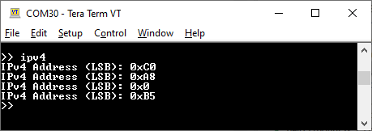

# XMC&trade; MCU: Flash BMI

This example demonstrates how boot mode index (BMI) can be used to configure a customized boot sequence on XMC4000 series of devices.

**Warning:** This code example involves programming the user configuration blocks (UCB), which can be programmed only a limited number of times. See the [Design and implementation](#design-and-implementation) section before proceeding with this code example.

## Requirements

- [ModusToolbox™ software](https://www.infineon.com/cms/en/design-support/tools/sdk/modustoolbox-software/) v3.0
- [SEGGER J-Link software](https://www.segger.com/downloads/jlink/#J-LinkSoftwareAndDocumentationPack)
- Programming Language: C
- Associated parts: [XMC™ 4000 series MCU](https://www.infineon.com/cms/en/product/microcontroller/32-bit-industrial-microcontroller-based-on-arm-cortex-m/32-bit-xmc4000-industrial-microcontroller-arm-cortex-m4/) parts

## Supported toolchains (make variable 'TOOLCHAIN')

- GNU Arm® embedded compiler v10.3.1 (`GCC_ARM`) - Default value of `TOOLCHAIN`
- Arm&reg; compiler v6.16 (`ARM`)
- IAR C/C++ compiler v9.30.1 (`IAR`)

## Supported kits (make variable 'TARGET')

- [XMC4200 Platform2GO XTREME Kit](https://www.infineon.com/cms/en/product/evaluation-boards/kit_xmc_plt2go_xmc4200/) (`KIT_XMC_PLT2GO_XMC4200`)
- [XMC4300 relax EtherCAT Kit](https://www.infineon.com/cms/en/product/evaluation-boards/kit_xmc43_relax_ecat_v1/) (`KIT_XMC43_RELAX_ECAT_V1`)
- [XMC4400 Platform2GO XTREME Kit](https://www.infineon.com/cms/en/product/evaluation-boards/kit_xmc_plt2go_xmc4400/) (`KIT_XMC_PLT2GO_XMC4400`)
- [XMC4500 relax kit](https://www.infineon.com/cms/en/product/evaluation-boards/kit_xmc45_relax_v1/) (`KIT_XMC45_RELAX_V1`)
- [XMC4700 relax kit](https://www.infineon.com/cms/en/product/evaluation-boards/kit_xmc47_relax_v1/) (`KIT_XMC47_RELAX_V1`) - Default value of `TARGET`
- [XMC4800 relax EtherCAT kit](https://www.infineon.com/cms/en/product/evaluation-boards/kit_xmc48_relax_ecat_v1/) (`KIT_XMC48_RELAX_ECAT_V1`)

## Hardware setup

This example uses the board's default configuration. See the kit user guide to ensure that the board is configured correctly.

## Software setup

- Install a terminal emulator if you don't have one. Instructions in this document use [Tera Term](https://ttssh2.osdn.jp/index.html.en).

<details><summary><b>In Eclipse IDE for ModusToolbox&trade; software</b></summary>

1. Click the **New Application** link in the **Quick Panel** (or, use **File** > **New** > **ModusToolbox&trade; Application**). This launches the [Project Creator](https://www.infineon.com/ModusToolboxProjectCreator) tool.

2. Pick a kit supported by the code example from the list shown in the **Project Creator - Choose Board Support Package (BSP)** dialog.

   When you select a supported kit, the example is reconfigured automatically to work with the kit. To work with a different supported kit later, use the [Library Manager](https://www.infineon.com/ModusToolboxLibraryManager) to choose the BSP for the supported kit. You can use the Library Manager to select or update the BSP and firmware libraries used in this application. To access the Library Manager, click the link from the **Quick Panel**.

   You can also just start the application creation process again and select a different kit.

   If you want to use the application for a kit not listed here, you may need to update the source files. If the kit does not have the required resources, the application may not work.

3. In the **Project Creator - Select Application** dialog, choose the example by enabling the checkbox.

4. (Optional) Change the suggested **New Application Name**.

5. Enter the local path in the **Application(s) Root Path** field to indicate where the application needs to be created.

   Applications that can share libraries can be placed in the same root path.

6. Click **Create** to complete the application creation process.

For more details, see the [Eclipse IDE for ModusToolbox&trade; software user guide](https://www.infineon.com/MTBEclipseIDEUserGuide) (locally available at *{ModusToolbox&trade; software install directory}/ide_{version}/docs/mt_ide_user_guide.pdf*).

</details>

<details><summary><b>In command-line interface (CLI)</b></summary>

ModusToolbox&trade; software provides the Project Creator as both a GUI tool and the command line tool, "project-creator-cli". The CLI tool can be used to create applications from a CLI terminal or from within batch files or shell scripts. This tool is available in the *{ModusToolbox&trade; software install directory}/tools_{version}/project-creator/* directory.

Use a CLI terminal to invoke the "project-creator-cli" tool. On Windows, use the command line "modus-shell" program provided in the ModusToolbox&trade; software installation instead of a standard Windows command-line application. This shell provides access to all ModusToolbox&trade; software tools. You can access it by typing `modus-shell` in the search box in the Windows menu. In Linux and macOS, you can use any terminal application.

This tool has the following arguments:

Argument | Description | Required/optional
---------|-------------|-----------
`--board-id` | Defined in the `<id>` field of the [BSP](https://github.com/Infineon?q=bsp-manifest&type=&language=&sort=) manifest | Required
`--app-id`   | Defined in the `<id>` field of the [CE](https://github.com/Infineon?q=ce-manifest&type=&language=&sort=) manifest | Required
`--target-dir`| Specify the directory in which the application is to be created if you prefer not to use the default current working directory | Optional
`--user-app-name`| Specify the name of the application if you prefer to have a name other than the example's default name | Optional

<br>

The following example clones the "[Flash BMI](https://github.com/Infineon/mtb-example-xmc-flash-bmi)" application with the desired name "MyFlashBMI" configured for the *KIT_XMC_PLT2GO_XMC4200* BSP into the specified working directory, *C:/mtb_projects*:

   ```
   project-creator-cli --board-id KIT_XMC_PLT2GO_XMC4200 --app-id mtb-example-xmc-flash-bmi --user-app-name MyFlashBMI --target-dir "C:/mtb_projects"
   ```

**Note:** The project-creator-cli tool uses the `git clone` and `make getlibs` commands to fetch the repository and import the required libraries. For details, see the "Project creator tools" section of the [ModusToolbox&trade; software user guide](https://www.infineon.com/ModusToolboxUserGuide) (locally available at *{ModusToolbox&trade; software install directory}/docs_{version}/mtb_user_guide.pdf*).

</details>

<details><summary><b>In third-party IDEs</b></summary>

Use one of the following options:

- **Use the standalone [Project Creator](https://www.infineon.com/ModusToolboxProjectCreator) tool:**

   1. Launch Project Creator from the Windows Start menu or from *{ModusToolbox&trade; software install directory}/tools_{version}/project-creator/project-creator.exe*.

   2. In the initial **Choose Board Support Package** screen, select the BSP, and click **Next**.

   3. In the **Select Application** screen, select the appropriate IDE from the **Target IDE** drop-down menu.

   4. Click **Create** and follow the instructions printed in the bottom pane to import or open the exported project in the respective IDE.

<br>

- **Use command-line interface (CLI):**

   1. Follow the instructions from the **In command-line interface (CLI)** section to create the application, and then import the libraries using the `make getlibs` command.

   2. Export the application to a supported IDE using the `make <ide>` command.

   3. Follow the instructions displayed in the terminal to create or import the application as an IDE project.

For a list of supported IDEs and more details, see the "Exporting to IDEs" section of the [ModusToolbox&trade; software user guide](https://www.infineon.com/ModusToolboxUserGuide) (locally available at *{ModusToolbox&trade; software install directory}/docs_{version}/mtb_user_guide.pdf*).

</details>

## Operation

1. Connect the board to your PC using a micro-USB cable through the debug USB connector.

2. Open a terminal program and select the J-Link CDC UART COM port. Configure the terminal with baud rate of 115200, data bits of 8, stop bits of 1, and with parity and flow control set to none.

3. Program the board using Eclipse IDE for ModusToolbox&trade; software:

   1. Select the application project in the Project Explorer.

   2. In the **Quick Panel**, scroll down, and click **\<Application Name> Program (JLink)**.

4. Once programmed, open your serial terminal software. You should see the shell application displayed as shown follows:

   **Figure 1. Shell application**

   

5. Do the following to install flash read protection using the shell application:

   1. Type `status` to get the status of the BMI installation and UCB program count:

      ```
      >> status
      ```

      **Figure 2. BMI installation status**

      

   2. Type `install` to install the BMI configuration into UCB2.

      The device will reset after this command for the changes to take effect.

      For example:

      ```
      >> install
      ```

      **Figure 3. Install BMI configuration**

      

   3. Check the status to see if the BMI installation was successful. The UCB program count will also be displayed.

      ```
      >> status
      ```

      **Figure 4. BMI installation status**

      

   4. Type `usb` to read the USB serial number loaded into DSRAM1:

      ```
      >> usb
      ```

      **Figure 5. USB serial number**

      

   5. Type `mac` to read the MAC address loaded into DSRAM1:

      ```
      >> mac
      ```

      **Figure 6. MAC address**

      

   6. Type `ipv4` to read the IPv4 address (LSB) loaded into DSRAM1:

      ```
      >> ipv4
      ```

      **Figure 7. IPV4 address (LSB)**

      


**Note:** If the kit is reset or power cycled when running this example, the program will start in normal mode because of the state of the TMS/TCK pins even if the BMI has been installed previously. Therefore, the BMI installation status will be seen as invalid. Install the BMI string again if this happens.

<br>

## Debugging

You can debug the example to step through the code. In the IDE, use the **\<Application name> Debug (JLink)** configuration in the **quick panel**. For details, see the "Program and debug" section in the [Eclipse IDE for ModusToolbox&trade; software user guide](https://www.infineon.com/MTBEclipseIDEUserGuide).

## Design and implementation

XMC4000 family of devices supports several boot modes such as the following:

- Normal boot mode
- Alternative boot mode
- Fallback ABM
- PSRAM boot mode
- ASC BSL boot mode
- CAN BSL boot mode
- Boot mode index (BMI)

BMI mode allows you to customize the boot sequence using a BMI string. The BMI string is written into the **user configuration block 2 (UCB) Page1**. This defines the set of activities to be performed on startup.

Upon reset, the startup software copies the BMI string into a 64-byte location in DSRAM1. These 64 bytes can be used to store the MAC address, USB serial number, and the IP address.

In this code example, UCB2 is programmed with a BMI string that copies the MAC address, USB serial number, and the IP address to DSRAM1 before going into normal boot Mode.

A custom linker script specifies the additional size required to store the BMI string in the DSRAM region. It is located in the *CUSTOM_DESIGN_MODUS* folder of the respective kits. The Makefile variable `LINKER_SCRIPT` specifies the custom linker script to be selected corresponding to the `TARGET` being used.

**Figure 8. Firmware flow diagram**


The code example uses a shell application to take input commands from the user to perform five different operations:

Command | Description
------- | -----------------
`install` | Installs the BMI string into UCB2
`usb` | Retrieves USB serial number from DSRAM1
`mac` | Retrieves the MAC address from DSRAM1
`ipv4` | Retrieves the IPv4 address from DSRAM1
`status` | Displays the BMI installation status

<br>

**Warning:** The BMI String is modified by erasing and programming the UCB2. **The erase and re-program of the UCBs can be performed up to four times. Exceeding this limit may make the device unusable.**


## Resources and settings

The code example uses a custom *design.modus* file because it uses the **universal serial interface channel (USIC)** block to implement the shell application. The following settings were modified in the default *design.modus* file.

**Figure 9. USIC (UART) settings**


<br>

**Figure 10. UART Rx settings**


<br>

**Figure 11. UART Tx settings**


## Related resources
Resources | Links
----------|--------
Kit guides  | [XMC4200 Platform2GO XTREME kit](https://www.infineon.com/dgdl/Infineon-XMC4200_Platform2Go-UserManual-v01_00-EN.pdf?fileId=5546d4626f229553016f8fca76c12c96) <br> [XMC4300 relax EtherCAT kit](https://www.infineon.com/dgdl/Infineon-XMC4300_Relax_Kit-UM-v01_00-EN.pdf?fileId=5546d46269e1c019016a78da2104554d) <br> [XMC4400 Platform2GO XTREME kit](https://www.infineon.com/dgdl/Infineon-XMC4400_Platform2Go-UserManual-v01_00-EN.pdf?fileId=5546d4626f229553016f8fc159482c94) <br> [XMC4500 relax kit](https://www.infineon.com/dgdl/Board_Users_Manual_XMC4500_Relax_Kit-V1_R1.2_released.pdf?fileId=db3a30433acf32c9013adf6b97b112f9) <br> [XMC4700/XMC4800 relax kit series-V1](https://www.infineon.com/dgdl/Infineon-Board_User_Manual_XMC4700_XMC4800_Relax_Kit_Series-UM-v01_02-EN.pdf?fileId=5546d46250cc1fdf01513f8e052d07fc)
| Code examples on Github | [Using ModusToolbox&trade; software](https://github.com/Infineon/Code-Examples-for-ModusToolbox-Software)
 Device documentation  | [XMC4000 family datasheets](https://www.infineon.com/cms/en/product/microcontroller/32-bit-industrial-microcontroller-based-on-arm-cortex-m/32-bit-xmc4000-industrial-microcontroller-arm-cortex-m4/#document-group-myInfineon-49) <br> [XMC4000 family technical reference manuals](https://www.infineon.com/cms/en/product/microcontroller/32-bit-industrial-microcontroller-based-on-arm-cortex-m/32-bit-xmc4000-industrial-microcontroller-arm-cortex-m4/#document-group-myInfineon-44)
Development kits | [XMC&trade; MCU eval boards](https://www.infineon.com/cms/en/product/microcontroller/32-bit-industrial-microcontroller-based-on-arm-cortex-m/#boards)
Libraries on GitHub | [mtb-xmclib-cat3](https://github.com/Infineon/mtb-xmclib-cat3) – XMC&trade; MCU peripheral library (XMCLib) and docs
Tools | [Eclipse IDE for ModusToolbox&trade; software](https://www.infineon.com/modustoolbox) – ModusToolbox&trade; software is a collection of easy-to-use software and tools enabling rapid development with Infineon MCUs, covering applications from embedded sense and control to wireless and cloud-connected systems using AIROC&trade; Wi-Fi and Bluetooth® connectivity devices.         |

## Other resources

Infineon provides a wealth of data at www.infineon.com to help you select the right device, and quickly and effectively integrate it into your design.

For XMC&trade; MCU devices, see [32-bit XMC™ industrial microcontroller based on Arm® Cortex®-M](https://www.infineon.com/cms/en/product/microcontroller/32-bit-industrial-microcontroller-based-on-arm-cortex-m/).

## Document history

Document title: *CE232718* - *XMC&trade; MCU: Flash BMI*

| Version | Description of change |
| ------- | --------------------- |
| 1.0.0   | New code example      |
| 1.1.0   | Added support for new kits |
| 2.0.0   | Updated to support ModusToolbox&trade; software v3.0. <br> This CE is not backward-compatible with previous versions of ModusToolbox™ software |
------

All other trademarks or registered trademarks referenced herein are the property of their respective owners.

© 2023 Infineon Technologies AG

All Rights Reserved.

### Legal Disclaimer

The information given in this document shall in no event be regarded as a guarantee of conditions or characteristics. With respect to any examples or hints given herein, any typical values stated herein and/or any information regarding the application of the device, Infineon Technologies hereby disclaims any and all warranties and liabilities of any kind, including without limitation, warranties of non-infringement of intellectual property rights of any third party.

### Information

For further information on technology, delivery terms and conditions and prices, please contact the nearest Infineon Technologies Office (www.infineon.com).

### Warnings

Due to technical requirements, components may contain dangerous substances. For information on the types in question, please contact the nearest Infineon Technologies Office.

Infineon Technologies components may be used in life-support devices or systems only with the express written approval of Infineon Technologies, if a failure of such components can reasonably be expected to cause the failure of that life-support device or system or to affect the safety or effectiveness of that device or system. Life support devices or systems are intended to be implanted in the human body or to support and/or maintain and sustain and/or protect human life. If they fail, it is reasonable to assume that the health of the user or other persons may be endangered.

-------------------------------------------------------------------------------
